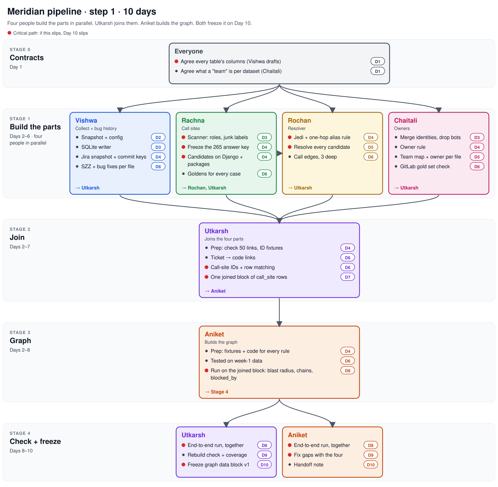

# Pipeline plan · step 1 · 10 days

Build stages 1–4 of [04-architecture](../docs/04-architecture.md): Collect, Extract, Join, Graph. At the end we hand over one thing: **graph data block v1**.

**How it flows:** four people build the parts in parallel. Each hands their part to Utkarsh. Utkarsh joins them into one block and hands it to Aniket. Aniket builds the graph. Both run it end to end and freeze it on Day 10.

**Critical path** (red dots): Rachna's scanner → Rochan's resolver → Utkarsh's join → Aniket's graph run → freeze. If any of these slips, Day 10 slips.

## What we hand over by Day 10

One SQLite file per run, append-only, byte-identical on rebuild.

- Tables: `run`, `call_site` (owner, `bug_fixes`, status, `blocked_by`, `effective_date`), `ticket_map`, `chain`, `blast_radius`
- A coverage report: call sites unresolved, tickets unmapped, files unowned, parse failures
- A golden test in CI: frozen snapshot → this exact file
- A one-page handoff note for the next stages (stall rules, Jev, views)

## Rules

- **Day 1 locks the contracts.** Changing one later needs Utkarsh and Aniket's OK.
- **Nobody waits.** Until the writer lands (Day 3), write rows to the contract as JSON or CSV. Until real inputs arrive, build on week-1 data or fixtures.
- **Deadlines mean done by end of that day.** If one will slip, say so at the daily 15-minute sync.
- **After Day 6, the four stay on call** to fix their own part when the end-to-end run finds a gap.
- **Every number has a script.** Same as week 1.

---

## Stage 0 · Contracts · Day 1 · everyone

| Task | Owner | Due | Done when |
|---|---|---|---|
| Columns and types for every table: the 4 in [03-data](../docs/03-data.md) plus `candidate`, `resolution`, `call_edge`, `person_alias`, `team_map`, `ticket`, `commit_ticket`, `file_bug_fixes`, `blast_radius` | Vishwa drafts, everyone agrees their own | D1 | Every table has an owner and is agreed |
| What a "team" is per dataset: Jira component (Spark), `group::` label (GitLab), a rule for Django | Chaitali | D1 | Written in `meridian.toml` |

## Stage 1 · Build the parts · Days 2–6 · four in parallel

### Vishwa · Collect + bug history → Utkarsh

| Task | Due | Done when |
|---|---|---|
| Snapshot by `run_id` (repo SHAs, raw Jira and GitLab JSON), `run` row, `meridian.toml` loader | D2 | Fixture repo + mock Jira load |
| SQLite writer: sorted output, content-hash IDs, append-only | D3 | Same rows twice → same file |
| Jira rolled back to `snapshot_at`, mass closes excluded, commit keys → `commit_ticket`. Start from `week1/pair2/jira/` | D4 | 94% of last 1,000 Spark commits keyed, as in week 1 |
| SZZ + `bug_fixes` per file over 365 days, 2015+ | D6 | Beats churn on the 130 Defects4J labels |

### Rachna · Call sites → Rochan, Utkarsh

| Task | Due | Done when |
|---|---|---|
| Scanner: rules per symbol from config, roles, junk labels, Python outside `.py`, parse failures counted. Start from `week1/pair1/scripts/scan_sites.py` | D3 | Runs on Django and the packages |
| Freeze the Django 265 answer key | D4 | Hand-checked, committed |
| Candidates on Django + packages → Rochan | D4 | 265 of 265, 0 false · packages ≥ 97% |
| Goldens for every case in [05-test](../docs/05-test.md) (assignment alias, `code.sample`, `is_anonymous = lambda`, re-export) | D6 | All pass |

### Rochan · Resolver → Utkarsh

| Task | Due | Done when |
|---|---|---|
| Pinned Jedi, one env per repo, one-hop rule (`_ = old_name`). Start from `q2_jedi.py` on week-1 candidates | D4 | 542 of 542 |
| Resolve every candidate: `ast_resolved`, `ast_unresolved` (kept), dropped. Score on the old name | D5 | Precision ≥ 0.98 |
| Caller → callee edges, resolved only, depth ≤ 3 → `call_edge` | D6 | Edge fixtures pass |

### Chaitali · Owners → Utkarsh

| Task | Due | Done when |
|---|---|---|
| Merge identities (`.mailmap` + name and email), drop bots, author not committer | D3 | 455 Spark duplicates merged, biggest groups hand-checked |
| Owner rule: 180 days, top author's team by share, tie → most recent, < 0.30 → `unowned` | D4 | Rule runs on Spark |
| `team_map` + owner per file | D5 | Beats last toucher (week 1: 20% vs 18%) |
| GitLab gold set: merge the two lists of 30 (≥ 38 issues), spot-check 10 wait, 5 planned, 5 partial | D6 | ≥ 9 of 10 waits hold |

## Stage 2 · Join · Days 2–7 · Utkarsh → Aniket

| Task | Needs | Due | Done when |
|---|---|---|---|
| Prep: hand-check 50 more Spark links. Call-site ID fixtures (insert, move, rename, duplicate, split) | — | D4 | 100 of 100 links · fixtures written |
| Ticket → code: linked-commit files, exact path, stack frame, exact symbol. No fuzzy matching → `ticket_map` | Vishwa, Rachna, Rochan | D6 | Path and trace precision ≥ 0.90 |
| Call-site IDs + matching to last run (renames, `removed` / new, `effective_date`) | Rachna, Rochan | D6 | Fixtures 100% · Django replay error ≤ 1% |
| One joined block: `call_site` rows with owner, `bug_fixes`, status, plus `call_edge` and `ticket_map` → Aniket | all four | D7 | Every row has an owner or `unowned`, and a status |

## Stage 3 · Graph · Days 2–8 · Aniket

| Task | Needs | Due | Done when |
|---|---|---|---|
| Prep: one fixture per rule (`blocked_by`, blast radius, 4 chain types, cycles), and code that passes them | — | D4 | Fixtures 100% |
| Tested on week-1 data (Spark tickets, Django call sites) | — | D6 | Runs without errors |
| Run on Utkarsh's block: blast radius (depth ≤ 3), chains (`depends_on`, `duplicates`, `collides`, untracked), `blocked_by` (different owners, within 3 resolved calls, imports alone don't count) | Utkarsh | D8 | Precision ≥ 0.90 vs Chaitali's gold set |

## Stage 4 · Check + freeze · Days 8–10 · Utkarsh and Aniket

| Task | Owner | Due | Done when |
|---|---|---|---|
| First end-to-end run | Utkarsh + Aniket | D8 | One SQLite file, every table filled |
| Rebuild check (same snapshot twice, full = incremental) + coverage report | Utkarsh | D9 | 0 diffs · every gap has a count |
| Fix gaps, with the four on their own parts | Aniket | D9 | Every pass bar met, or the miss written down |
| Freeze graph data block v1, golden test in CI | Utkarsh | D10 | CI green |
| Handoff note for stall rules, Jev, views | Aniket | D10 | One page, every table explained |

---

## Which data each part runs on

All from week 1. Nothing new to find.

| Part | Dataset |
|---|---|
| Call sites, resolver, Join | Django (265 key, 542 aliases), packages for cross-repo |
| Owners | Spark git |
| Jira, ticket links, ticket → code | Spark + Jira |
| SZZ, `bug_fixes` | Spark + Jira, scored on Defects4J |
| Graph | Fixtures, plus the GitLab gold set for ticket-level chains |

No single dataset fills every column. Django uses Trac, not Jira, so Django rows have no `ticket_map`. GitLab is Ruby, so code-level `blocked_by` runs on fixtures only. [02-product](../docs/02-product.md) already accepts both, and the screen says so.

## Open on Day 1

1. **CSV policy** from [week 1](../week1/NEXT-STEPS.md): push result CSVs, or copies with usernames removed
2. **Team for Django:** directories, or everything `unowned`

## Dropped first if we're behind

- Method-call benchmark with 100+ uses (Rochan)
- Component-level owner test (Chaitali)
- Defects4J bisection on the 724 unlabelled bugs
- Replaying 50 Django pushes

Out of scope for step 1: push check (P1, P7, P8), stall rules, Jev, gate, views.
