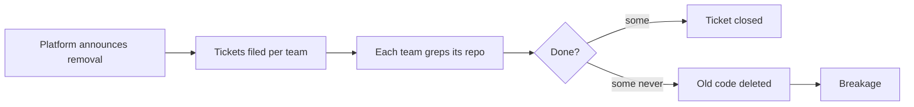
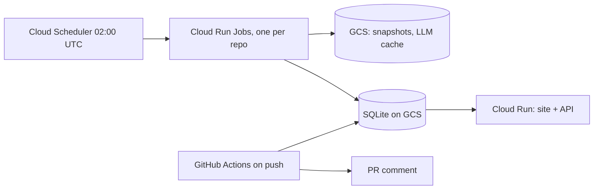

# Project Scoping · Meridian

**Rough draft.** Numbers are from week 1 (`week1/`) and `docs/`.

**Team:** Aniket Ghosh, Rochan Hanumanthu, Chaitali Vivek Nimse, Vishwa Divyeshbhai Pujara, Utkarsh Saraogi, Sree Rachnae Shyam

## 1. Introduction

When a platform team retires an internal API, it files tickets, some never get done, the old code is deleted, and things break. Meridian joins code, git, and Jira to show every remaining call site of a dying API, who owns it, how risky it is, which teams block each other, and why the work stalled. It suggests diffs and tickets. It doesn't apply them.

It does the cross-codebase review a staff engineer would do: it catches bugs that cross team lines and architecture problems no single repo shows, such as a shared client that quietly blocks three teams.

**This is step one toward [self-maintaining APIs](https://www.ycombinator.com/rfs#self-maintaining-apis) (Y Combinator Request for Startups):** software that updates its own callers when an API changes.
- We can't build that yet, because nobody publishes the data it needs: which fixes teams accept, and why migrations stall.
- Once Meridian is live, it collects that data on every run: suggestions applied, edited or ignored, and stalls with their real causes.
- When teams start applying our diffs unchanged, the next step is making the changes ourselves.

## 2. Dataset information

**Introduction.** There's no customer data yet, so we test on public migrations where the right answer is known.

**Data card**

| Dataset | What we use it for | Size | Format |
|---|---|---|---|
| Django `ugettext` removal (`4353640ea9` → `c651331b34`, 2017) | Answer key for finding call sites | 2,374 `.py` files. Answer key: 265 lines to edit, 542 alias calls | Git repo, Python |
| Apache Spark + Jira (snapshot 2026-10-01) | Ticket ↔ commit join, bug history, owners, ticket state over time | 45,312 commits, 59,491 tickets, 160,370 status changes. 179 MB SQLite | Git + Jira REST JSON |
| Django packages moving off `url()` | Same migration across many repos | 20 repos (+8 spares), ~1,085 call sites, ~875 MB | Git repos, Python |
| Defects4J + Fonte labels | Checks our "which commit caused the bug" code | 854 bugs, 17 Java projects, 130 bug-causing commits | Git + CSV |
| Cross-team candidates (Debian py2removal, OpenStack, Mozilla) | Blocks between teams, stalled work | Not pulled yet | Bug trackers + git |

**Sources:** github.com/django/django · github.com/apache/spark · issues.apache.org/jira (REST, no login) · the 28 package repos listed in `week1/pair3/` · github.com/rjust/defects4j · github.com/coinse/fonte

**Rights and privacy**
- All repos are open source (Django BSD-3, Spark Apache-2.0, Defects4J MIT). Package licenses are checked per repo.
- Commits and Jira hold real names and emails. That's personal data under GDPR, even though it's public.
  - Raw data stays out of git, in local files or GCS.
  - Emails are only used to merge identities.
  - Intake strips personal data before storing anything.
- For a customer, everything runs inside their cloud, and the data stays theirs.

## 3. Data planning and splits

- **Load:** each run freezes a snapshot (repo SHAs, raw Jira JSON) and never re-queries. Same snapshot gives the same output.
- **Preprocess:**
  - Parse with tree-sitter, then resolve names with Jedi.
  - Merge author aliases and drop bots.
  - Roll Jira back to the snapshot date.
  - Exclude mass-closed tickets.
- **Splits:** by time, never random.
  - Fragility: train on the year before 2025-10-01, test on the year after.
  - Ownership: cut at 2026-04-01.
  - Answer keys are hand-checked and frozen in week 4.
- **Manage:** large data stays out of git. Small labels and results are committed, and every number has a script that reproduces it.

## 4. GitHub repository

https://github.com/Itsme-aniketghosh/Meridian

```
docs/       problem, product, data, architecture, tests, dead ideas
week1/      dataset checks: pair1 (Django), pair2 (Spark+Jira), pair3 (packages, Defects4J), cross-team
scoping/    this document
README.md   overview and doc index
```

## 5. Project scope

**Problems**
1. Teams find out late that they call a dying API.
2. Jira says done while the code says otherwise (31 closed vs 21 remaining in our example).
3. Owners in CODEOWNERS are stale, so tickets go to the wrong team.
4. Risky call sites look the same as safe ones.
5. Teams block each other through a shared client and don't know it.
6. One team adds call sites while others remove them.
7. Nobody knows why the migration stalled.

**Current solutions:**
- Grep plus spreadsheets.
- Sourcegraph (search).
- OpenRewrite (automated rewrites, but someone has to write the recipe, and Python support is thin).
- Jira dashboards.

None of these covers #5 or #7.

**Proposed solution:**
- One dated map: call sites, owners, risk, and ticket links.
- Hidden blocks found from the code.
- A ranked list of stall reasons.
- Suggested diffs and ticket rewrites.
- A note on every push.

## 6. Current approach and bottlenecks



| Bottleneck | Our fix |
|---|---|
| Grep misses aliases (0 of 542 alias calls) | Parser plus resolver (533 of 542) |
| Ticket status isn't code status | Ticket ↔ commit join (94% of commits keyed) |
| Wrong owner | Owner from commit share, plus an alias table |
| Hidden block | Cross-team block graph, built from the code |
| Silent stall | Stall rules and ranked reasons |

## 7. Metrics, objectives, business goals

| Metric | Bar | Week 1 |
|---|---|---|
| Call-site recall / precision | ≥ 0.95 / ≥ 0.98 | 265 of 265, 0 false |
| Alias resolution | ≥ 0.95 | 533 of 542 (0.983) |
| Ticket link precision | ≥ 0.95 | 50 of 50 |
| Fragility vs `bug_fixes` baseline | beats it | 9.7x lift |
| Owner vs last toucher | beats it | 20% vs 18% |
| Push alerts | median ≤ 1, precision ≥ 0.80, p95 ≤ 5 min | not run yet |
| Determinism | 0 diffs on rebuild | 0 (Spark build) |

- **Objective:** migrations finish, and fewer things break after the old API is removed.
- **Business goal:** suggestions get used and the burndown speeds up. If they're ignored and the burndown is flat by week 8, we've built a dashboard.

## 8. Failure analysis

| Risk | Mitigation |
|---|---|
| No public data shows cross-team blocks or stalls | Hand-checked gold set (Debian, OpenStack, Mozilla), or fixtures only, said on screen |
| Method calls don't resolve (Jedi 5 of 30) | Keep unresolved matches, labelled |
| Weak owner signal | Owner by team (Jira component) |
| LLM invents numbers | A gate checks every fact; on a miss the template ships |
| Jira down / force-push / parse failure | Code-only run / halt that repo / exclude and count |
| Incremental run ≠ full rebuild | Halt, keep the last good run |
| False push alerts | Never blocks a merge. Precision tracked |

## 9. Deployment infrastructure



- **Supported:** GitHub repos, Jira REST, Python (Java parsing via tree-sitter-java is planned)
- **LLM:** Jev picks the agent and model for each task. Models are pinned in `meridian.toml`
- **Cost:** a billing alert from day 1. Push checks run on the free GitHub runner

## 10. Monitoring plan

- **Every run:**
  - coverage: % of call sites resolved, % of tickets mapped
  - parse failures
  - partial runs
- **Quality:**
  - gate fallback rate
  - Jev's success rate per agent and model
  - push alert precision
- **Use:** each suggestion's outcome (applied, edited, ignored), and burndown before vs after
- **Ops:** job memory, runtime, rebuild diffs, spend

## 11. Success and acceptance

- Every pass bar in section 7 is met on frozen benchmarks.
- A rebuild is byte-identical, and every view still works with the LLM off.
- Suggestions get applied unchanged. Burndown moves faster than before.

## 12. Timeline (preliminary)

| Week | Goal |
|---|---|
| 1 | Dataset checks (done) |
| 2–3 | Extract + join on Django. Push check P1, P7, P8 |
| 4 | Freeze answer keys. Spark ticket links. Ticket checks |
| 5 | Graph, chains, block detection |
| 6 | Jev, LLM gate, diffs |
| 7 | Auditor learning |
| 8 | Outcome review: used, or just a dashboard? |

## 13. Additional information

- Rejected ideas, and why: `docs/06-dead-ideas.md`
- Open question: data for cross-team blocks (`week1/cross-team/NEXT-STEPS.md`)
- Scope: we suggest only. No PRs, no filed tickets, until suggestions get applied unchanged
